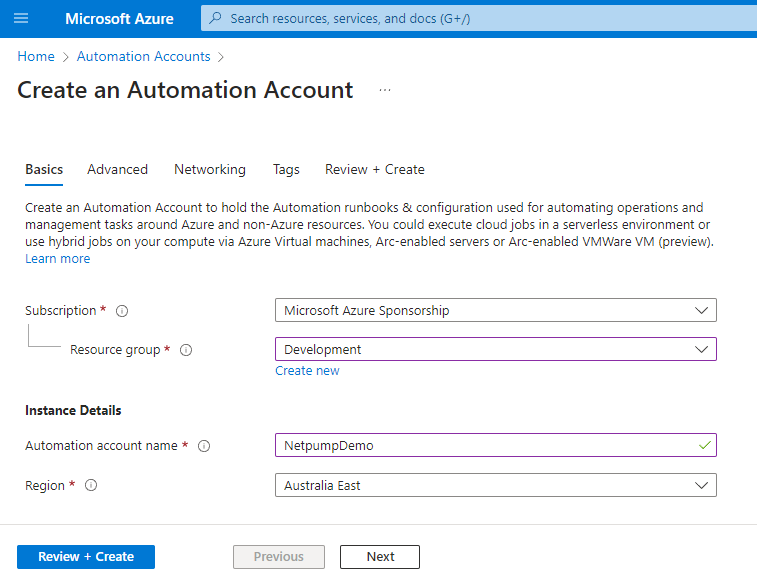
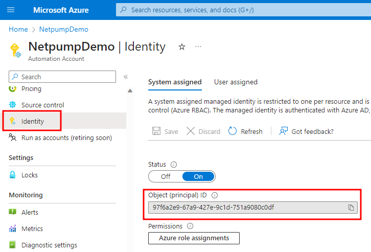
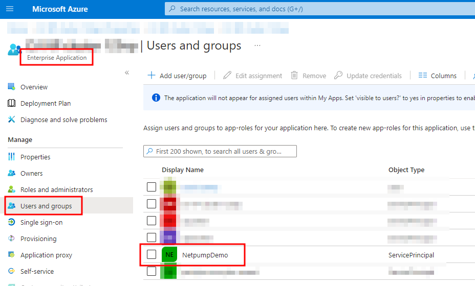
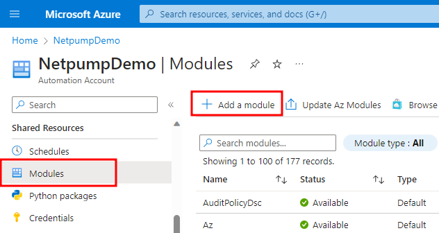
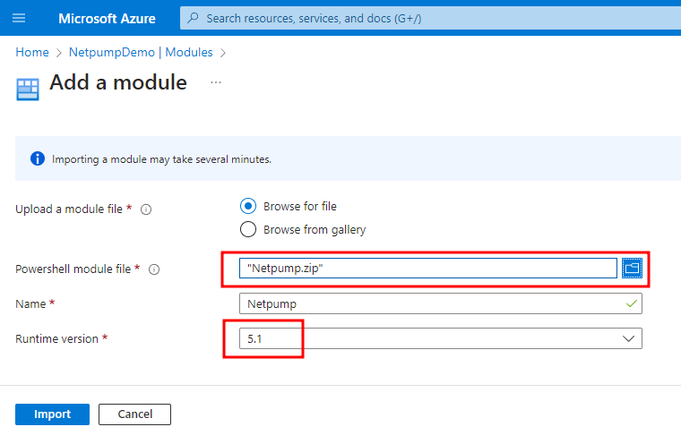
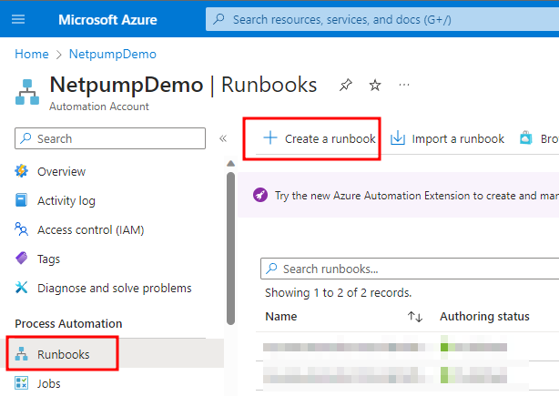
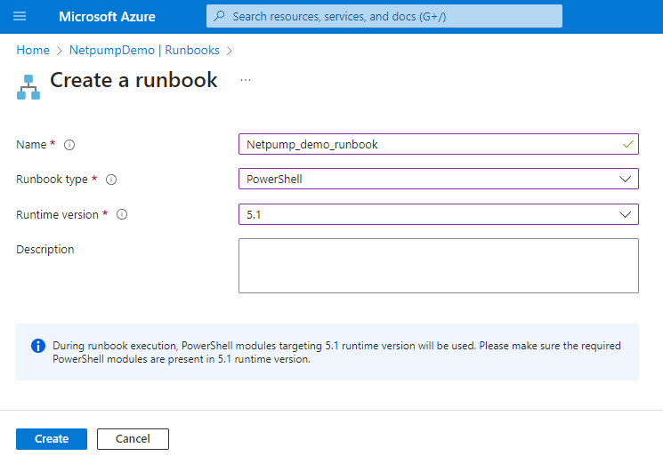
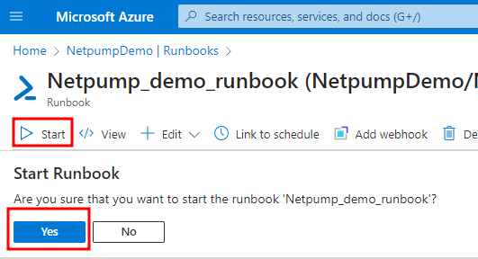

# PowerShell Scripting Guide

Netpump file transfers can be initiated programmatically over an HTTPS REST API. We supply a PowerShell module that provides a convenient interface to make these API calls using the `Start-NetpumpTransfer` command.

## Authentication
The Netpump PowerShell script depends on Microsoft's [Az PowerShell](https://learn.microsoft.com/en-us/powershell/azure/install-azure-powershell?view=azps-10.3.0) module.

Your PowerShell environment must call [Connect-AzAccount](https://learn.microsoft.com/en-us/powershell/module/az.accounts/connect-azaccount?view=azps-10.3.0) to authenticate prior to calling `Start-NetpumpTransfer`.

The Azure account you use must have the Automation role for the Netpump Server App Registration in Azure.

## Netpump module

The module is contained in [Netpump.zip](Netpump.zip). Extract this zip file and use the PowerShell command `Import-Module .\Netpump.psm1` to import it.

The `Start-NetpumpTransfer` command starts a transfer.

Run `Get-Help Start-NetpumpTransfer` to see further documentation.

## Walkthrough: Azure Automation Runbook

In this example we will create an Azure Automation Runbook to initiate a Netpump file transfer.

We will create the Automation Account, grant the Automation Account's Service Principal permission to use the Netpump cluster, create a simple Runbook, and transfer a file.

### Prerequisites

You will need two Netpump servers in a Netpump cluster already set up.

For the initial setup, you will need PowerShell with the Microsoft.Graph module installed. (Run `Install-Module Microsoft.Graph -Scope CurrentUser`, or see [Microsoft.Graph documentation](https://learn.microsoft.com/en-us/powershell/microsoftgraph/installation?view=graph-powershell-1.0) for further installation options.)

You will need to know the following information, which you would have used when setting up your Netpump servers:

* Tenant ID of your Azure Active Directory tenant.
* Object ID of your Netpump cluster Enterprise Application (note: the Enterprise Application is different to the App Registration).
* App Role ID of the `Automation` role you created during the App Registration
* URLs of the origin and destination Netpump servers
* Source UNC path of the file to transfer from the origin server
* Destination UNC path of where to store the file on the destination server


### Steps

1. Download [Netpump.zip](Netpump.zip) which contains the PowerShell module. You will upload this to the Azure Automation Account later in this walkthrough.
2. In Azure Portal, create a new Automation Account

    

3. Go to the newly created Automation Account
4. Click in the Identity section in the left menu and copy the Object (principal) ID to the clipboard

    
5. Run PowerShell on your local computer
6. At the PowerShell prompt, run `Connect-MgGraph -TenantId $tenantId -Scopes "User.Read","Application.ReadWrite.All"`
7. At the PowerShell prompt, run `New-MgServicePrincipalAppRoleAssignment -ServicePrincipalId $SERVICE_PRINCIPAL_OBJECT_ID -PrincipalId $SERVICE_PRINCIPAL_OBJECT_ID -ResourceId $NETPUMP_ENTERPRISE_APP_OBJECT_ID -AppRoleId $AUTOMATION_APP_ROLE_ID`. Replace each of the $VARIABLEs in this command with your actual values, which will all be GUIDs in the format `00000000-0000-0000-0000-000000000000`.
8. To confirm that the above command was successful, check the Enterprise Application for your Netpump cluster, on the Users and groups page, the name of your Automation Account should now appear in the list.

    
9. Back in the Automation Account, click in the Modules section in the left menu and click Add a Module

    

10. Upload the `Netpump.zip` file and choose 5.1 for the PowerShell version. Click Import.

    

11. Go to the Runbooks section in the left menu and click Create a runbook.

    

12. Choose a name for the runbook, type of PowerShell, version 5.1, and click Create.

    

13. Edit the Runbook and enter the following script, replacing the parameters with your origin and destination server URLs and your origin and destination UNC paths:
```
Connect-AzAccount -Identity
Import-Module Netpump
Start-NetpumpTransfer -DestinationService https://YOUR-URL -DestinationFolder \\YOUR-UNC\YOUR-SHARE\YOUR-FOLDER -OriginService https://YOUR-URL -Paths \\YOUR-UNC\YOUR-SHARE\YOUR-SOURCE-FILE
```

14. Click Publish

15. Click Start, and Yes to confirm

    

16. Your file is copied from the source to the destination via Netpump


    
