This guide will show you how to setup the app registration for a Netpump Server cluster through Azure portal.

Each cluster of Netpump Servers uses a single app registration. All Netpump Servers in the cluster can communicate with each other. All users assigned to the app registration can use the Netpump Servers.

## Audience
The user of this guide should have basic or moderate knowledge of how to use Azure Portal, and Microsoft Entra ID.

## Steps

### Create new App Registration
1. Goto `https://portal.azure.com` and login
2. Search for `Microsoft Entra ID` and click on it.

   ![Search for Microsoft Entra ID][click-entra-id]

3. Click `Add` then select `App Registration`

   ![Add App Registration][click-add-app-registration]

4. Type in a name for the app e.g. `Netpump Server`

5. Select `Accounts in this organizational directory only`

6. Click `Register`

### Set up API requirements for the App Registration

#### Setup the Application ID URI

1. Click `Expose an Api`

   ![Click on Expose an Api][click-expose-api]

2. Click `Add` next to the `Application ID URI`

   ![Click to add Application ID URI][expose-api-id-uri] 

3. Click `Save`

   ![Save the Application ID URI][expose-api-id-uri-save]
   > :information_source: **Note:** Whether you use a default value or a specific value is based on individual company policy, it has no impact on Netpump.

#### Create scope `Transfers.All`

1. Click `Add a Scope`

   ![Click to add a scope][add-a-scope]

2. Fill in the form in with the below values
   > :information_source: **Note:** Only `Scope Name` is required to match the below value, the consent display names and descriptions can be adjusted to suit company requirements and policy.

   |||
   | ------------- | ------------- |
   | **Scope name**\* | Transfers.All |
   | Who can consent?  | Admin and users |
   | Admin consent display name  | Allows all Transfer Operations |
   | Admin consent description | Allows a user to handle all operation in relations Transfers |
   | User consent display name  | Transfer Admin |
   | User consent description  | Allows a user to handle all operation in relations Transfers |

   ![Fill in scope settings][transfer-all-form]

3. Click `Add Scope`

#### Add authorized client applications

1. Click `Add a client application`

   ![Click to add a client application][add-client-application]

2. Add the client ID `d99b6435-bf29-4655-a1a2-ed1dbad109b3`

   > :information_source: **Note:** This guid is for the global Netpump Desktop Application 

3. Tick boxes for
   * `Transfers.All`
      > :information_source: **Note:** The prefix will change depending on the Application ID URI 

   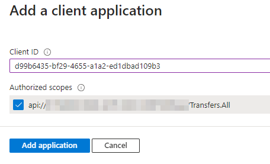

4. Click `Add application`

### Create an App Role

1. Click `App roles`

   ![App role][300-approlemenu]

2. Click `Create App Role`

3. Enter the details as follows:

   |||
   | ------------- | ------------- |
   | Display name | Automation |
   | Allowed member types | Applications |
   | Value | Automation |
   | Description | Server to server and script access |

   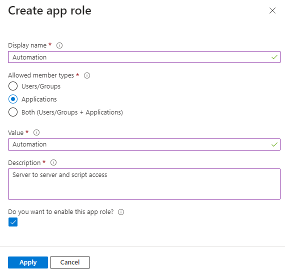

4. Click `Apply`

### Setup permissions

1. Click `API permissions`

   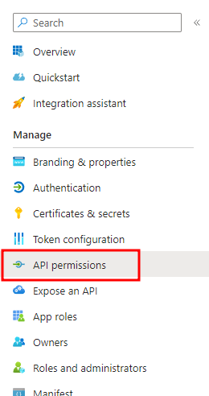

2. Click `Add permission`

   ![Alt text][click-add-permission]

3. Click `APIs my Organization Uses`

4. Search for `Netpump Server`
   > :information_source: **Note:** The name will depend what name you gave the application in the `App Registration`

   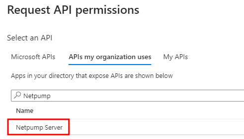

5. At the "What type of permission?" question, choose `Delegated`, and add the `Transfers.All` permission

   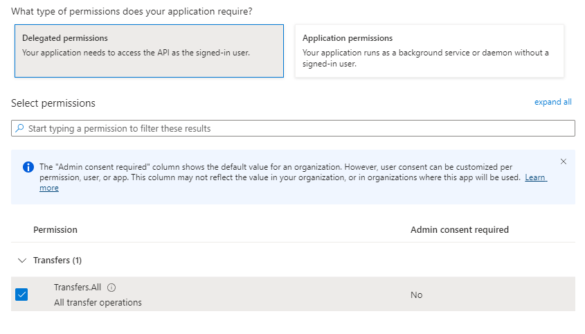

6. Click `Add permissions` to save this permission.

7. Click `Add permission` a second time

   ![Alt text][click-add-permission]

8. Search for `Netpump Server` again
   > :information_source: **Note:** The name will depend what name you gave the application in the `App Registration`

9. At the "What type of permission?" question, this time choose `Application`, and add the `Automation` permission

   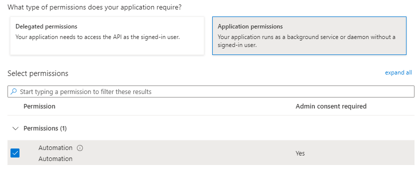

10. Click `Add permissions` to save this permission.

### Create the Client Secret

1. Click `Certificates & secrets`

   ![Alt text][create-certificates-secrets]

2. Click `New client secret`

   ![Alt text][new-client-secret]

3. Enter a description for this secret, select the desired expiry (per company requirements) and click `Add`
   > :information_source: **Note:** This secret will be used for the authentication settings when provisioning Netpump servers.

4. Copy the client secret and save it for Netpump server provisioning later
   > :information_source: **Note:** You can not view this secret after you leave this page.

   ![Alt text][copy-secret]

### Edit the manifest

1. Click `Manifest` in the menu

   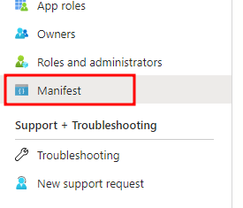

2. Edit the manifest to set `accessTokenAcceptedVersion` to the value `2`

   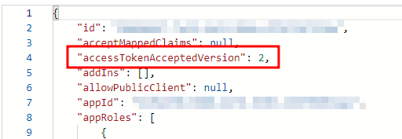

3. Click `Save`

### Assign users

1. Click `Overview` in the menu

2. Click on the link next to the `Managed application in local directory` label

   

3. Click `Properties`

4. Set `Assignment Required` to `Yes`

   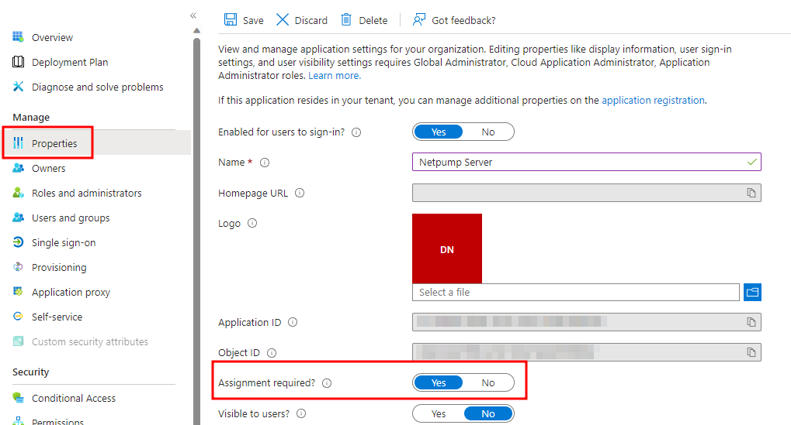

5. `Save`

6. Click `Users and groups`

7. Add all users who require access to configure or use the Netpump service

   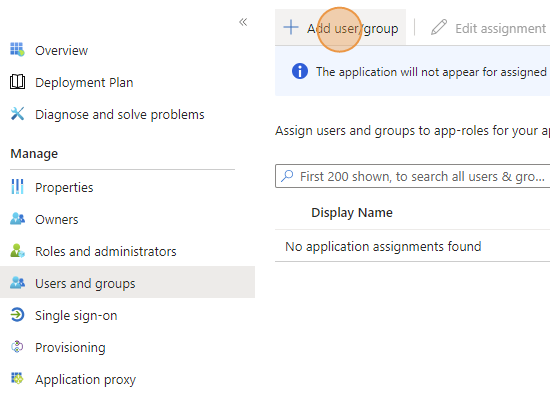

### Key Vault - Service Principal permissions

> :information_source: **Note:** As a prerequisite, you need a Key Vault with a valid SSL certificate for the domain you want to host your Netpump server on. The steps below cover giving your app registration (service principal) access to that Key Vault.

1. Open your Key Vault resource in Azure Portal and click on `Access control (IAM)`

2. Click on `Add` > `Add role assignment`

   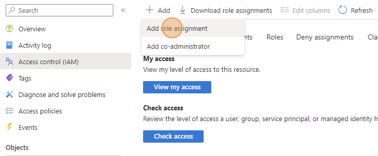

3. Select the `Key Vault Secrets User` role then click `Next`

   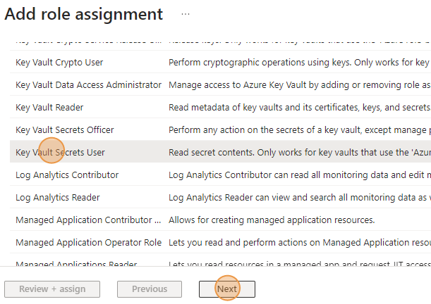

4. Click `Select members` then search for `Netpump Server`
   > :information_source: **Note:** The name will depend what name you gave the application in the `App Registration`

   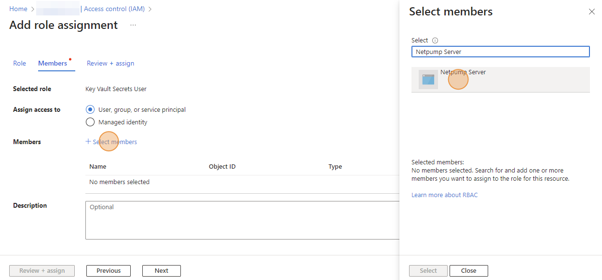

5. Click `Select`

6. Click `Next`

7. Confirm the details and click `Review + assign`

   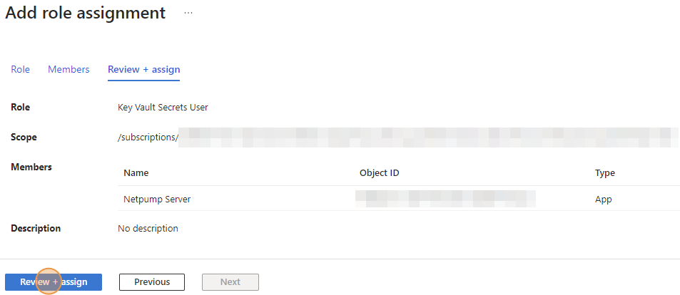

## Ready to provision cluster
You are now ready to provision your Netpump server cluster.

[add-a-scope]: images/add-a-scope.png
[transfer-all-form]: images/transfer-all-form.png
[file-transfer]: images/file-transfer.png
[click-entra-id]: images/app-reg/100-entra-id.png
[click-add-app-registration]: images/app-reg/200-appreg.png
[click-app-registration-supported]: images/app-registration-supported.png
[click-expose-api]: images/click-expose-api.png
[expose-api-id-uri]: images/expose-api-id-uri.png
[expose-api-id-uri-save]: images/expose-api-id-uri-save.png
[add-client-application]: images/add-client-application.png
[client-id]: images/client-id.png
[client-authorized-scopes]: images/client-authorized-scopes.png
[click-api-permissions]: images/click-api-permissions.png
[click-add-permission]: images/click-add-permission.png
[click-my-apis]: images/click-my-apis.png
[click-my-apis-netpump-server]: images/click-my-apis-netpump-server.png
[my-apis-add-file-transfer]: images/my-apis-add-file-transfer.png
[my-apis-add-transfers-all]: images/my-apis-add-transfers-all.png
[create-certificates-secrets]: images/create-certificates-secrets.png
[new-client-secret]: images/new-client-secret.png
[copy-secret]: images/copy-secret.png
[300-approlemenu]: images/app-reg/300-approlemenu.png
